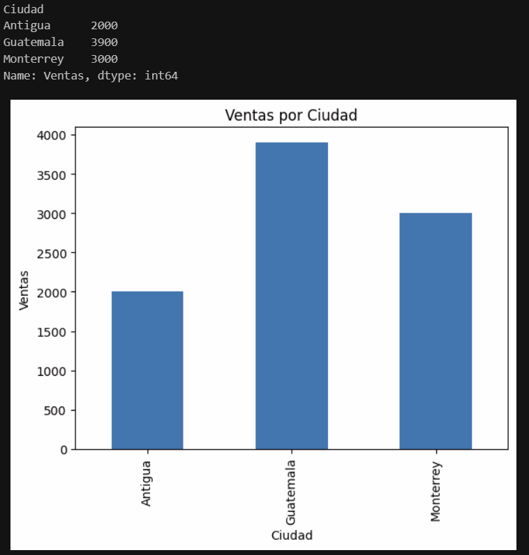

# Análisis de Ventas con Python

Proyecto de análisis de datos utilizando Python, enfocado en la exploración y visualización de ventas por ciudad y producto.

## Objetivo
Analizar datos de ventas para identificar patrones, tendencias y oportunidades de mejora en la toma de decisiones.

## Tecnologías utilizadas
- Python
- Pandas
- Matplotlib
- Jupyter Notebook

## Análisis realizados
- Ventas totales por ciudad
- Comparación de productos
- Identificación de la ciudad con mayor volumen de ventas

## Visualización
Se generó una gráfica de barras para representar las ventas por ciudad.

## Estructura del proyecto
analisis-ventas-python/
│
├── analisis.ipynb
├── README.md
└── .gitignore

## Conclusión
Se identificó que ciertas ciudades concentran mayor volumen de ventas, lo cual puede ser aprovechado para estrategias comerciales y marketing.

Desarrollado por Sergio Aspuac como practica de las tecnologías con py, pandas, matlotlib, jupyter

## Ejemplo de resultado

